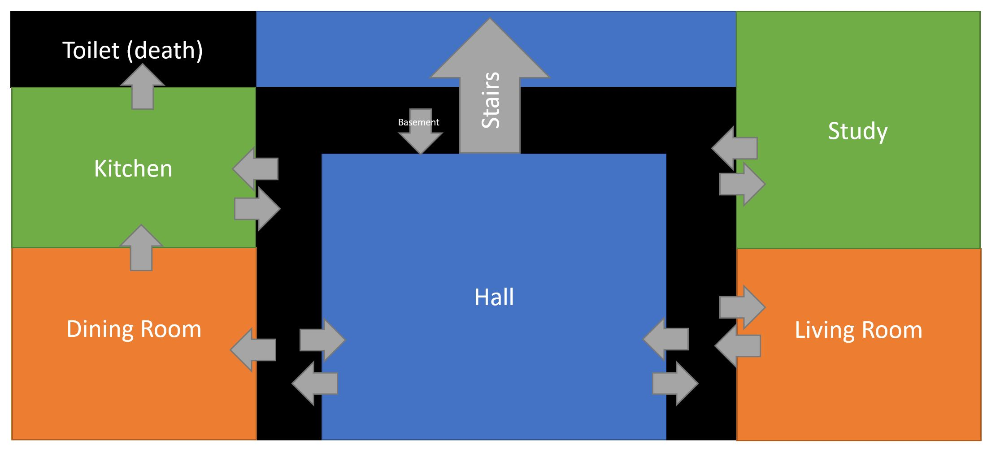
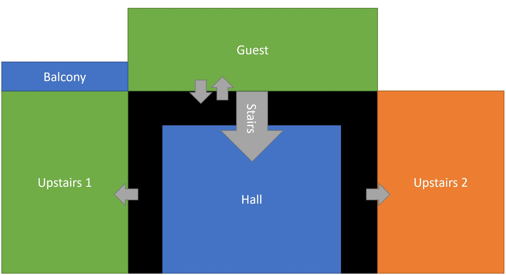
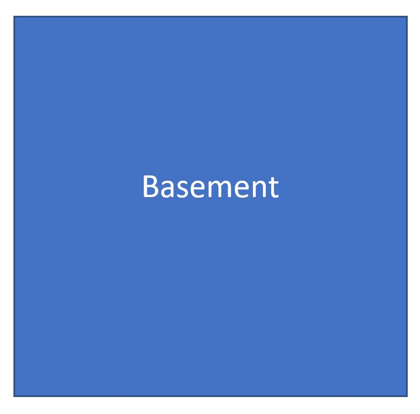
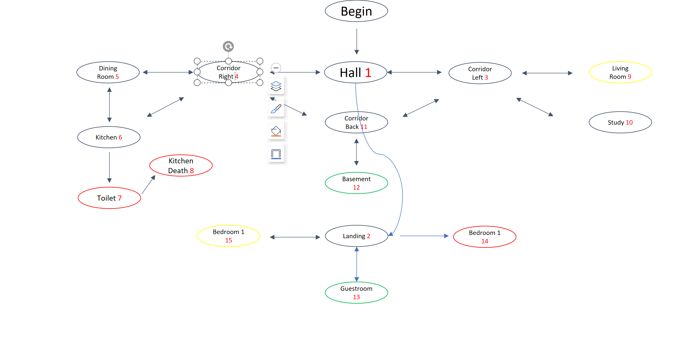
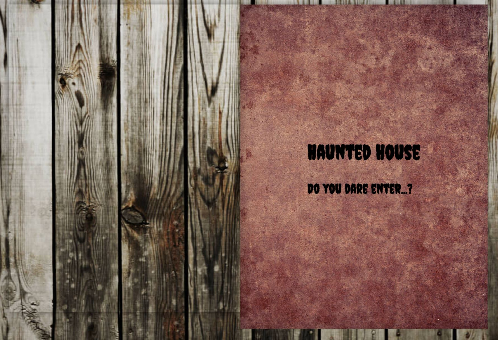
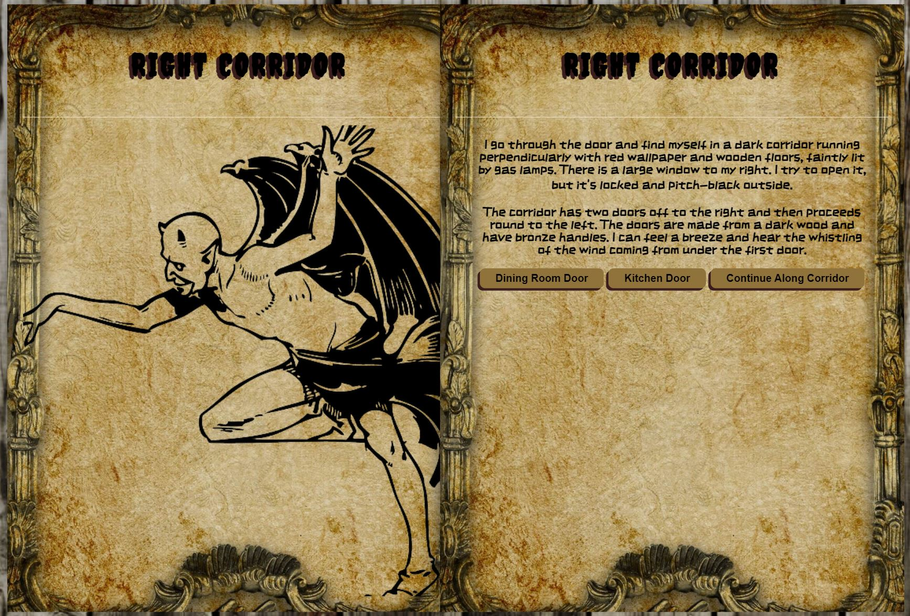
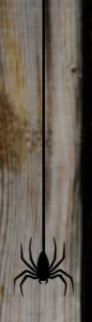
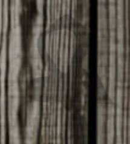
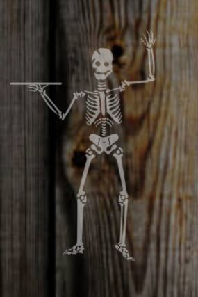

# :ghost: Halloweenathon :jack_o_lantern:
[Live project here.](https://oldman10000.github.io/halloweenathon/)

## About :derelict_house:

Welcome to our spooky halloween hackathon interactive story book. Live as the main character in a story based on true events whilst making choices about where to go and how best to survive. Be warned there are many wrong turns, and many challenges ahead but if you manage to keep your cool and not run away in fear, you may just make it out alive mwa ha ha ha ha.

## UXD

### Goals

The app is designed to keep a user stuck to their seat using equal parts of fear and fun. The goal was to create an interative choose your own path story book that drew on regular tropes within horror stories to create a story that would be scary for everyone. We also wanted the story to be fun and so have included challenges through-out the app. Additionally we wanted the story to be complicated enough with different paths to complete it so that there was some replay value.

### User Stories

As a user playing for the first time, I want a narrative that is engrossing.
As a user playing for the first time, I want to be scared
As a user playing for the first time, I want multiple interactive elements
As a user playing for the first time, I want to be able to win and lose
As a returning user, I want a different experience

Target Audience

- This interactive story is aimed at anyone over the age of 15

## Structure

We divided up a story into bit-size chunks which would each be on individual webpages which would represent each page of a book. We wanted interactivity through out which we planned to include everything from the clicking of a button to turn a page to completing certain tasks to advance the story. 

### Story planning

The location of the story was first set as a haunted house. This was then draw out to allow us to create the paths that the player would take. These were map out as shown below.

## Skeleton

We used Balsamiq to put together a rough sketch of how we wanted the project to look. These are shown below.

## Surface

### Typography

Each part of the book was considered to add to the overall feel of spookiness. Font "ZCOOL KuaiLe" was chosen to give the feel of an antique and creepy book you might find if found yourself in a haunted house. The same font was used for all titles and paragraphs throughout in keeping with stylings of century-old books.

### Language / Tone

For a horror short story, the first person perspective is used to help develop a feeling of uneasiness in a short space of time without excessive desciptions. The frequent reveals that progress the story are used to give the reader the sense of fight or flight whilst jumpscares have been added to ensure the reader is unsettled. The tone through-out is one of helplessness and unknowing. The reader is never quite sure of where they are, why they are they or what to expect which are the key exponents that creates fear.

### Layout

In keeping with the structure of a book, all content is divided into two containers representing the left page and the right page of an open book. There will often be an image on the left page which helps to set the scene, followed by the story on the right page and the decision at the bottom.

### Imagery 

There is a background image of a tea-stain coloured old book used through-out as well as a page-turning optical effect to really emphasise that this story is being read from an old book and ensuring that the theme of halloween is never forgotten. The book is being read upon a wooder floor or table. This is another background image that is used throughout. Each room that you enter has an additional image representing it to give added visuals. Finally there are animations of spiders that will drop into view as your progress.

### Media

A spooky soundtrack is available but can be toggled. We recommend playing with the soundtrack as it adds to the atmosphere.

## Features

### Front Cover

The home page shows the front cover of the haunted book as seen below. The words "Do you dare enter?" appear letter by letter when you enter the site. The background behind the book is a wooden floor image. 

### Chapters

With the exception of the first two pages, each double page has a spooky picture on the left, situational story text on the right with a decision below the text which the player must make. This can be seen below:

### Animations

Throughout the program, many spooky animations can be found. Some examples are below:

The book has an animation to give the effect that the pages are actually turning

A spider will fall from the top of the screen from time to time

A ghost will appear to the right of the screen

A skeleton will appear to the right of the screen

### Sound effects

A spooky sound track can be enabled by clicking the button in the top left.

### Languages Used:

 1. [HTML](https://en.wikipedia.org/wiki/HTML) 
 - Markup language providing content and structure of website.

 2. [CSS](https://en.wikipedia.org/wiki/CSS) 
 - Styling language providing website styles and appearance.

 3. [Javascript](https://en.wikipedia.org/wiki/Javascript)
 - Animations and logic through-out the website
 
 ### Frameworks, Libraries & Programs Used:

    
 1. [GitPod](https://gitpod.io/)
    - IDE (Integrated Development Environment), for writing, editing and saving code.

 2. [GitHub](https://github.com/) 
    - Remote hosting platform and code  repository.

 3. [Balsamiq](https://balsamiq.com/):
    - Balsamiq was used to create the initial designs for the pages on the site.
 
 4. [Google Fonts](https://fonts.google.com/):
    - Google fonts were used to import both the Hachi Maru and Poppins fonts that are used on the site.

5. [Pexels](https://www.pexels.com/search/puppies/) / [Unsplash](https://unsplash.com/)
    - Copywrite free stock images used throughout website

6. [Am I Responsive?](http://ami.responsivedesign.is/)
    - Used to create 4 screen mock up image in Readme.

7. [Google Developer Tools](https://developers.google.com/web/tools) - including Lighthouse
    - Used to constantly test the code and give feedback. 

8. [Favicon](https://favicon.io/):
    - Favicon used to implement a favicon on the browser tab.

9. [GreenSock](https://greensock.com/):
    - GreenSock used to implement animations.

## Testing

### Manual Testing

- Each developer on the team has had the horrifying experience of clicking through all of the pages and all of the rooms.

## Bugs :cockroach:

## Credits

- [StPageFlip JavaScript Library](https://github.com/Nodlik/StPageFlip) - created by [Nodlik](https://github.com/Nodlik) - Used for page flip animations
- [Pexels.com](https://www.pexels.com/) - clipart style book images taken from various authors - specific credits not requested
- [Pixabay](https://pixabay.com/) - Pictures taken from Pixabay were used in the animations
